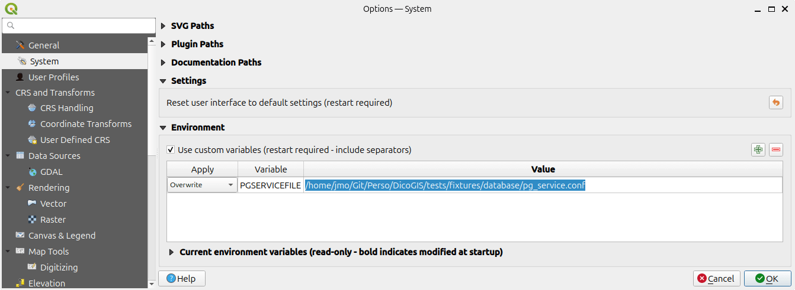
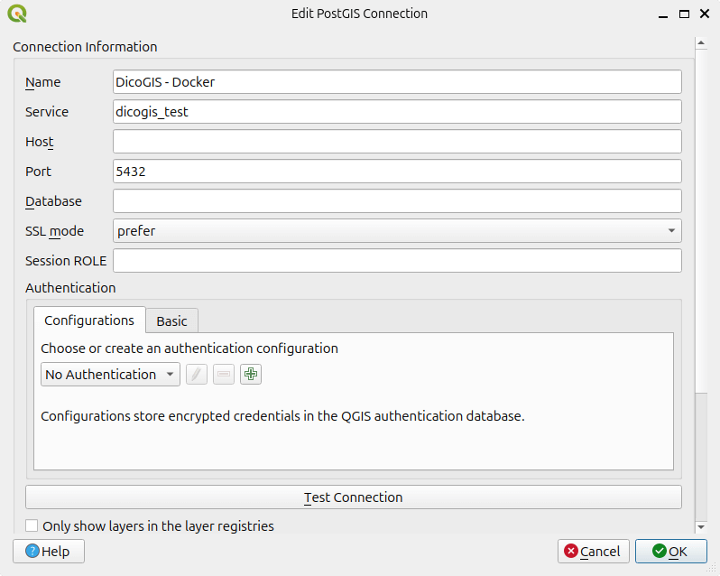
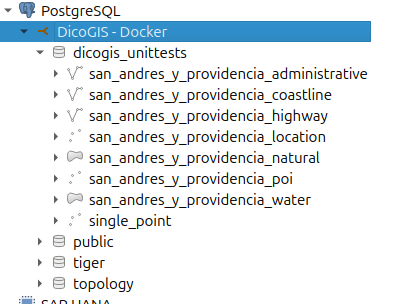

# Tests

To run tests, the project needs to set up:

- a folder tree with various geospatial formats
- a PostGIS database
- a uData instance to run publish operations

Commands below are meant to be used on Linux Bash but can be adapted to your own operating system.

## System requirements

- Git
- Docker >= 22
- DicoGIS locally cloned

## Testing setup

In your virtual environment:

1. Install development requirements ([Ubuntu](./ubuntu.md#requirements) or [Windows](./windows.md#requirements))
2. Install data fixtures:

    ```sh
    git clone --depth=1 https://github.com/qgis/QGIS-Training-Data.git ./tests/fixtures/qgisdata
    python -m pip install -U gisdata -t ./tests/fixtures
    ```

3. Launch full composition (PostGIS + uData):

    ```sh
    docker compose -f "tests/container/docker-compose.dev.yml" up -d --build
    ```

It's also possible to launch only PostGIS container:

```sh
docker compose -f "tests/container/docker-compose.dev.yml" up -d --build 'postgis'
```

## Try it out

## Inventory

On files:

```sh
dicogis-cli inventory --verbose --input-folder tests/fixtures
```

On PostGIS:

```sh
PGSERVICEFILE="./tests/fixtures/database/pg_service.conf"  dicogis-cli inventory --verbose --pg-services dicogis_test
```

:::{tip}
You can also connect to the database through QGIS during the container life cycle:

1. Recommended: create a QGIS profile dedicated to DicoGIS:

    ```sh
    qgis --profile dicogis
    ```

1. In QGIS settings, add an environment variable `PGSERVICEFILE` pointing to the file under `tests/fixtures/database/pg_service.conf`:

    

1. Restart QGIS
1. Create a connection with the following fields:

    

1. You can interact with the database:

    
:::

### Publish

1. Run an inventory with udata output:

    ```bash
    PGSERVICEFILE="./tests/fixtures/database/pg_service.conf" dicogis-cli inventory --language FR --output-format udata --pg-services dicogis_test --output-path ./tests/fixtures/tmp/udata
    ```

1. Publish it to the local instance:

```sh
dicogis-cli publish --input-folder ./tests/fixtures/tmp/udata  --udata-organization-id  OOOOOOOOOOOOOOOO --udata-api-url-base http://localhost:7010/api/ --udata-api-key XXXXXXXXXXXXXXXXX
```

## Run tests suite

```sh
pytest
```
