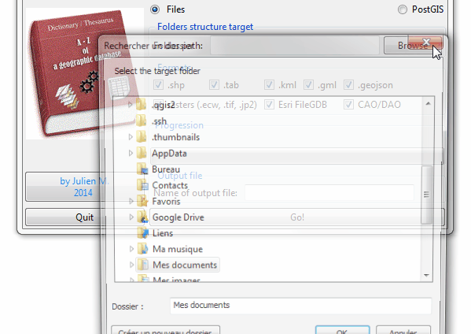
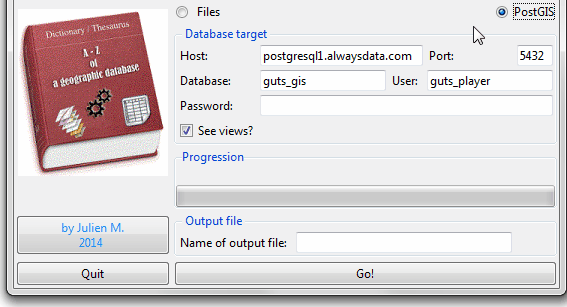

# DicoGIS : le dictionnaire de données SIG

Ou comment se créer un Petit Robert de l’information géographique en 5 minutes et 3 clics.
Je vous présente un petit utilitaire sans prétention sinon d'être bien pratique pour la gestion de données.

## Présentation de l’outil

[DicoGIS](https://github.com/Guts/DicoGIS) est un petit utilitaire qui produit un dictionnaire de données au format Excel 2003 (.xls). Disponible sous forme d’exécutable Windows (.exe) sans installation ou sous forme de script (voir les pré-requis) il peut donc s’utiliser directement sur une clé USB par exemple.

Quelques cas d'usage :

- on vous refile une base de données fichiers ou PostGIS dans laquelle vous aimeriez savoir ce qu’il peut bien y avoir dedans ;
- dans le cadre de votre travail ou d’un projet, vous souhaitez fournir facilement un dictionnaire des données fournies, que ce soit à vos collègues, partenaires ou clients.

## Caractéristiques techniques

Les formats pris en compte sont potentiellement tous ceux de [GDAL](https://gdal.org/drivers/raster/index.html) et [OGR](https://gdal.org/drivers/vector/index.html) mais pour l'instant voici ceux qui sont implémentés :

- vecteurs : shapefile, tables MapInfo, GeoJSON, GML, KML
- rasters : ECW, GeoTIFF, JPEG
- bases de données "plates" (fichiers) : Esri File GDB
- CAO : DXF (+ listing des DWG)
- Documents cartos : Geospatial PDF

En mode script Python, c'est (a priori...) multiplateformes et a été testé sur:

- Ubuntu 12/14.04
- Windows 7/8.1
- Mac OS X (merci à [GIS Blog Fr](https://twitter.com/gisblogfr/status/515068147901407232))

DicoGIS est disponible en [3 langues (Français, Anglais et Espagnol)](https://github.com/Guts/DicoGIS/tree/master/dicogis/locale/) mais il est facile de personnaliser et/ou d'ajouter les traductions.

En ce qui concerne les performances, cela dépend surtout de la machine sur laquelle DicoGIS est lancé. De mon côté, le traitement met environ 30 secondes pour :

- une quarantaine de vecteurs,
- une dizaine de rasters ( qui pèsent environ 90 Mo au total),
- 7 FileGDB contenant une soixantaine de vecteurs
- et quelques DXF.

## Comment l'utiliser

1. Télécharger la dernière version :

- soit de [l’exécutable Windows](https://github.com/Guts/DicoGIS/releases),
- soit du [code source](https://github.com/Guts/DicoGIS/archive/master.zip).

2. Dézipper et lancer DicoGIS.exe / le script DicoGIS.py

3. Changer la langue au besoin

4. Pour des données organisées en fichiers :

- Choisir le dossier parent : l’exploration commence et la barre de progression tourne jusqu’à la fin du listing
- Choisir les formats désirés

4/b Pour des données stockées dans une base PostgreSQL / PostGIS, c'est le même principe sauf qu'il faut entrer les paramètres de connexion :

5. Lancer et attendre la fin du traitement : sauvegarder le fichier Excel généré.

6. Consulter le fichier en sortie et le fichier DicoGIS.log (dans lequel il y a un paquet d'informations ^^).

## Résultats

En sortie, vous obtenez un fichier Excel dans lequel les métadonnées sont organisées en différents onglets correspondant au type de donnée. J'ai fait une [matrice des informations disponibles selon le format](../misc/formats_matrix.md).
