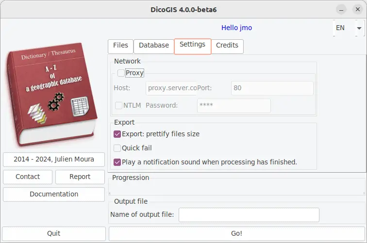

# Configuration

## Using graphical interface

Options are accessible through the `Settings` tab:

## Using environment variables

Some options and arguments can be set with environment variables.

| Variable name                  | Corresponding CLI argument | Default value      |
| :----------------------------- | :------------------------: | :----------------: |
| `DICOGIS_DEBUG`                | `-vvv`                     | `false`            |
| `DICOGIS_DEFAULT_LANGUAGE`     | `--language`               | `None`  |
| `DICOGIS_ENABLE_NOTIFICATION_SOUND` | `--notify-sound` / `--no-notify-sound` | `--notify-sound` |
| `DICOGIS_EXPORT_SIZE_PRETTIFY` | `--out-prettify-size` / `--no-out-prettify-size` | `--no-out-prettify-size` |
| `DICOGIS_FORMATS_LIST`         | `--formats`                | `dxf,esri_shapefile,geojson,gml,kml,mapinfo_tab,sqlite,ecw,geotiff,jpeg` |
| `DICOGIS_OUTPUT_FILEPATH`      | `--output-path`            | `None`  |
| `DICOGIS_OUTPUT_FORMAT`        | `--output-format`          | `excel` |
| `DICOGIS_POSTGRES_SERVICES`    | `--pg-services`            | `None`  |
| `DICOGIS_START_FOLDER`         | `--input-folder`           | `None`  |
| `DICOGIS_UI_THEME`             | UI theme. Can be any of the [ttkthemes](https://ttkthemes.readthedocs.io) | `breeze` on MacOS, `yaru` on Ubuntu, `radiance` on other Linux distributions, `breeze` on Windows |  
