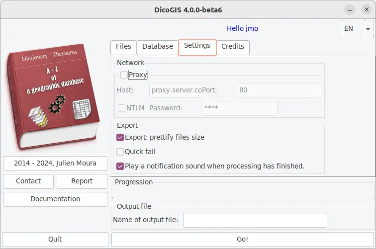

# Configuration

## Using graphical interface

Options are accessible through the `Settings` tab:

## Using environment variables

Some options and arguments can be set with environment variables.

### Shared (CLI and GUI)

| Variable name                       | Corresponding CLI argument                       | Default value |
| :---------------------------------- | :----------------------------------------------: | :-----------: |
| `DICOGIS_DEBUG`                     | `--verbose`                                      | `false`       |
| `DICOGIS_ENABLE_NOTIFICATION_SOUND` | `--opt-notify-sound` / `--no-opt-notify-sound`   | `true`        |
| `DICOGIS_EXPORT_RAW_PATH`           | `--opt-raw-path`                                 | `false`       |
| `DICOGIS_EXPORT_SIZE_PRETTIFY`      | `--opt-prettify-size` / `--no-opt-prettify-size` | `false`       |
| `DICOGIS_QUICK_FAIL`                | `--opt-quick-fail`                               | `false`       |

### GUI only

| Variable name      | Description                                                               | Default value |
| :----------------- | :------------------------------------------------------------------------ | :-----------: |
| `DICOGIS_UI_THEME` | UI theme. Can be any of the [ttkthemes](https://ttkthemes.readthedocs.io) | `arc` (overridden per OS: `breeze` on macOS and Windows, `radiance` on Linux, `ubuntu` on Ubuntu) |

### CLI only — `inventory` subcommand

| Variable name                       | Corresponding CLI argument                       | Default value      |
| :---------------------------------- | :----------------------------------------------: | :----------------: |
| `DICOGIS_DEFAULT_LANGUAGE`          | `--language`                                     | `None`             |
| `DICOGIS_FORMATS_LIST`              | `--formats`                                      | `dxf,esri_shapefile,geojson,gml,kml,mapinfo_tab,sqlite,ecw,geotiff,jpeg` |
| `DICOGIS_OPEN_OUTPUT`               | `--opt-open-output` / `--no-opt-open-output`     | `true`             |
| `DICOGIS_OUTPUT_FILEPATH`           | `--output-path`                                  | `None`             |
| `DICOGIS_OUTPUT_FORMAT`             | `--output-format`                                | `excel`            |
| `DICOGIS_POSTGRES_SERVICES`         | `--pg-services`                                  | `None`             |
| `DICOGIS_START_FOLDER`              | `--input-folder`                                 | `None`             |

### CLI only — `publish` subcommand

| Variable name                    | Corresponding CLI argument    | Default value                    |
| :------------------------------- | :---------------------------: | :------------------------------: |
| `DICOGIS_PUBLISH_INPUT_FOLDER`   | `--input-folder`              | `None`                           |
| `DICOGIS_UDATA_API_KEY`          | `--udata-api-key`             | `None`                           |
| `DICOGIS_UDATA_API_URL_BASE`     | `--udata-api-url-base`        | `https://demo.data.gouv.fr/api/` |
| `DICOGIS_UDATA_API_VERSION`      | `--udata-api-version`         | `1`                              |
| `DICOGIS_UDATA_ORGANIZATION_ID`  | `--udata-organization-id`     | `None`                           |
