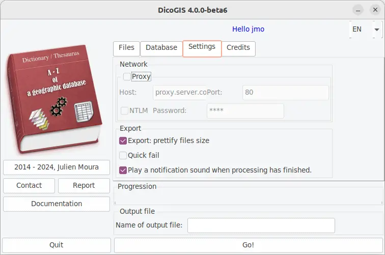

# Configuration

## Using graphical interface

Options are accessible through the `Settings` tab:

Publishing previously exported metadata (JSON files) to a uData catalog is done
through the `Publish` tab: pick the folder containing the JSON files, fill in the
uData catalog connection (API URL, version, key, and optionally an organization ID),
then use the `Launch` button.

## Using environment variables

Some options and arguments can be set with environment variables. When a
GUI widget exists for one of them (see the `Settings` tab above), the
environment variable only sets its initial value: the widget can override it,
and the choice persists across runs in `options.ini`.

### Shared (CLI and GUI)

| Variable name                       | Corresponding CLI argument                       | Default value |
| :---------------------------------- | :----------------------------------------------: | :-----------: |
| `DICOGIS_DEBUG`                     | `--verbose`                                      | `false`       |
| `DICOGIS_ENABLE_NOTIFICATION_SOUND` | `--opt-notify-sound` / `--no-opt-notify-sound`   | `true`        |
| `DICOGIS_EXPORT_RAW_PATH`           | `--opt-raw-path`                                 | `false`       |
| `DICOGIS_EXPORT_SIZE_PRETTIFY`      | `--opt-prettify-size` / `--no-opt-prettify-size` | `false`       |
| `DICOGIS_LISTING_MAX_WORKERS`       | `--listing-max-workers`                          | unset (auto, based on CPU count) |
| `DICOGIS_LISTING_PARALLEL_SCAN`     | `--opt-parallel-scan` / `--no-opt-parallel-scan` | `false`       |
| `DICOGIS_QUICK_FAIL`                | `--opt-quick-fail`                               | `false`       |

#### About the parallel folder scan

`DICOGIS_LISTING_PARALLEL_SCAN` scans the top-level subfolders of the target
folder in parallel worker threads instead of a single sequential walk. **It is
off by default, and enabling it is not always a win**: the per-file work is
mostly CPU-bound Python, so on local or otherwise fast storage the threads
mainly contend for the GIL and the scan gets *slower* (benchmarked at ~11x
slower on a local disk). It pays off on high-latency storage — typically a
network-mounted share — and the deeper the folder tree, the more it helps
(~5x faster on a 32-folder tree over a simulated 3 ms/`scandir()` link).

Rule of thumb: leave it off, and turn it on only when scanning a location you
know is slow to browse. `DICOGIS_LISTING_MAX_WORKERS` caps the number of worker
threads used when it's enabled (it is ignored otherwise); leave it unset to let
Python size the pool from the CPU count. In the GUI, the equivalent spinbox uses
`0` to mean "auto".

### GUI only

| Variable name      | Description                                                               | Default value |
| :----------------- | :------------------------------------------------------------------------ | :-----------: |
| `DICOGIS_UI_STYLE` | UI style. Can be any Qt style available on the running platform (e.g. `Fusion`, `Windows`) | unset (uses the Qt platform default) |

### CLI only — `inventory` subcommand

| Variable name                       | Corresponding CLI argument                       | Default value      |
| :---------------------------------- | :----------------------------------------------: | :----------------: |
| `DICOGIS_DEFAULT_LANGUAGE`          | `--language`                                     | `None`             |
| `DICOGIS_FORMATS_LIST`              | `--formats`                                      | `dxf,esri_shapefile,geojson,gml,kml,mapinfo_tab,sqlite,ecw,geotiff,jpeg` |
| `DICOGIS_OPEN_OUTPUT`               | `--opt-open-output` / `--no-opt-open-output`     | `true`             |
| `DICOGIS_OUTPUT_FILEPATH`           | `--output-path`                                  | `None`             |
| `DICOGIS_OUTPUT_FORMAT`             | `--output-format`                                | `excel`            |
| `DICOGIS_POSTGRES_SERVICES`         | `--pg-services`                                  | `None`             |
| `DICOGIS_START_FOLDER`              | `--input-folder`                                 | `None`             |

### Shared (CLI `publish` subcommand and GUI `Publish` tab)

These set the initial value of their `Publish` tab widget, same as the "Shared"
table above, except `DICOGIS_UDATA_API_KEY`: for security, the API key typed into
the GUI is never written to `options.ini`, so it must be re-entered (or re-exposed
through the environment variable) on every run.

| Variable name                    | Corresponding CLI argument    | Default value                    |
| :------------------------------- | :---------------------------: | :------------------------------: |
| `DICOGIS_PUBLISH_INPUT_FOLDER`   | `--input-folder`              | `None`                           |
| `DICOGIS_UDATA_API_KEY`          | `--udata-api-key`             | `None`                           |
| `DICOGIS_UDATA_API_URL_BASE`     | `--udata-api-url-base`        | `https://demo.data.gouv.fr/api/` |
| `DICOGIS_UDATA_API_VERSION`      | `--udata-api-version`         | `1`                              |
| `DICOGIS_UDATA_ORGANIZATION_ID`  | `--udata-organization-id`     | `None`                           |
